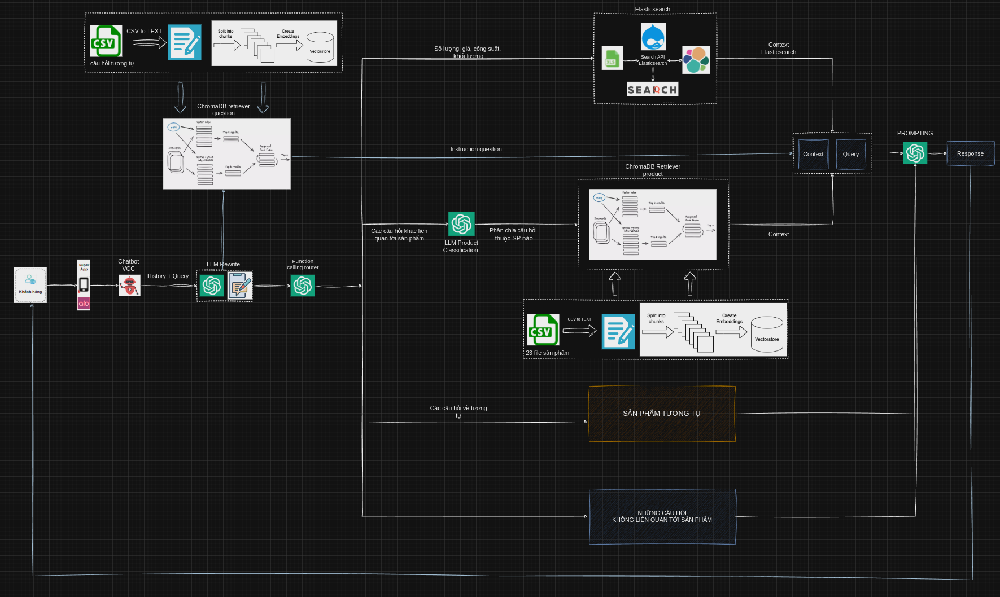
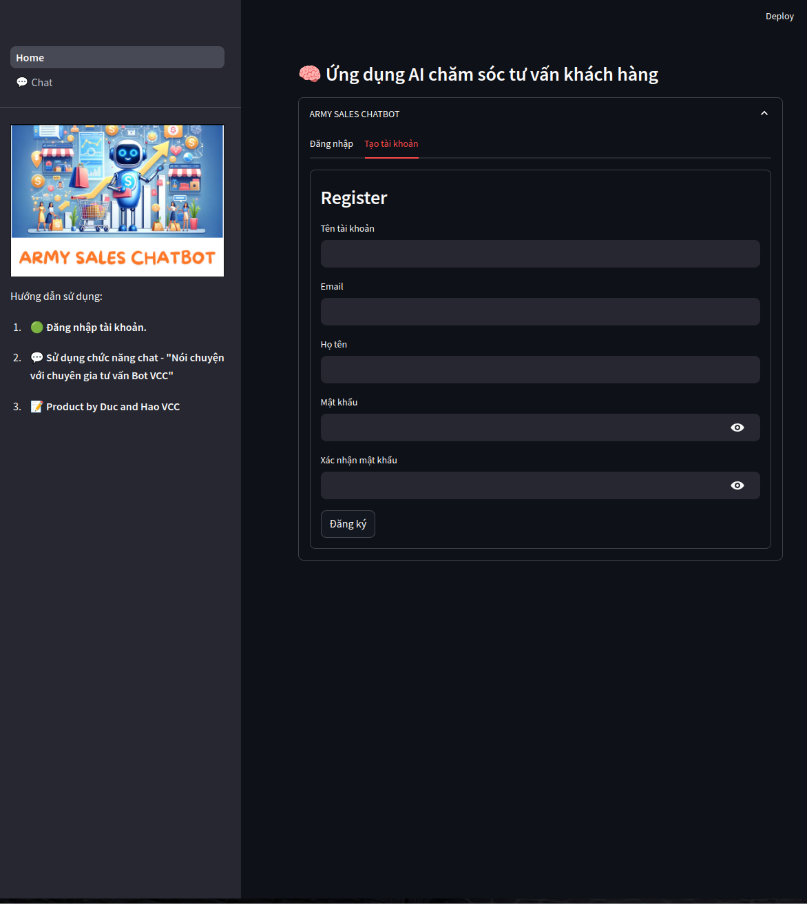
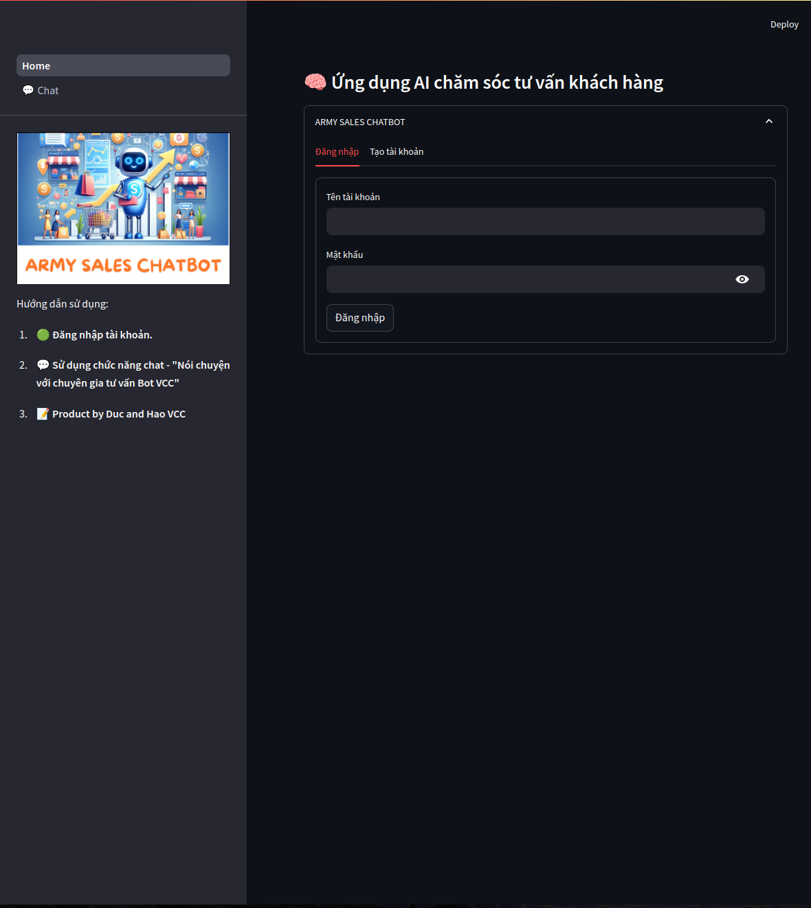

<div align="center">

</div>

<div align="center">

Chatbot sales army is a chatbot product aimed at selling and consulting products by interacting directly with customers. Chatbot uses RAG techniques - an advanced artificial intelligence solution that combines the ability to retrieve accurate information and the ability to generate natural answers.

</div>

## **1. Pipeline**

<div align="center">

</div>

## **2. Tree Project**
```bash
    ├── api
    │   ├── handle_request.py
    ├── app_api.py
    ├── configs
    │   ├── config_fewshot
    │   │   ├── config_fewshot.py
    │   │   ├── example_fewshot.yml
    │   ├── config_system.py
    │   ├── config.yml
    │   ├── __init__.py
    ├── data
    │   ├── data_private
    │   │   ├── data_csv
    │   │   │   ├── ban_la.csv
    │   │   │   ├── ....
    │   │   │   └── thiet_bi_wifi.csv
    │   │   ├── data_dienmayxanh.csv
    │   │   ├── data_text
    │   │   │   ├── ban_la.pkl
    │   │   │   ├── ....
    │   │   │   └── thiet_bi_wifi.pkl
    │   │   └── product_final_300_extract.xlsx
    │   └── vector_db
    │       ├── ban_la
    │       ├── ....
    │       └── thiet_bi_wifi
    ├── evaluate_system
    │   └── evaluater.py
    ├── Interface_gradio.py
    ├── Interface_streamlit.py
    ├── LICENSE
    ├── logs
    │   ├── error
    │   ├── logger.py
    │   ├── terminal
    │   └── times
    ├── pages
    │   └── 1_💬_Chat.py
    ├── README.md
    ├── requirements.txt
    ├── security
    │   ├── conversation_store
    │   │   └── ducpham.json
    │   └── info_user_store
    │       └── ducpham.json
    ├── source
    │   ├── generate
    │   │   ├── chat.py
    │   │   ├── chat_seasion.py
    │   ├── ingest_data
    │   │   ├── ingestion.py
    │   ├── prompt
    │   │   └── template.py
    │   ├── retriever
    │   │   ├── chroma
    │   │   │   └── retriever.py
    │   │   └── elastic_search
    │   │       ├── elastic_helper.py
    │   │       ├── few_shot_sentence.py
    │   │       ├── __init__.py
    │   │       └── query_engine.py
    │   ├── router
    │   │   ├── router.py
    │   │   ├── switch.py
    │   │   └── tool_calling.ipynb
    │   └── similar_product
    │       ├── crawler
    │       │   ├── crawler_website.py
    │       │   ├── ....
    │       │   └── specification.png
    │       └── searcher.py
    ├── static
    │   ├── avt_bot.png
    │   ├── ....
    │   ├── pipeline.png
    ├── test_code.py
    ├── ui
    │   ├── authenticate.py
    │   └── sidebar.py
    └── utils
        ├── __init__.py
        ├── schemas.py
        ├── timekeeper.py
        └── user_helper.py
```

## **3. To Install This Application, Follow These Steps:**
#### Step 1. Clone the repository:
    git clone https://github.com/PhamTrinhDuc/Chatbot_ver11
    cd Chatbot_ver11

#### Step 2. (Optional) Create and activate a virtual environment:
- For Unix/macOS:
```bash
python3 -m venv .venv
source .venv/bin/activate
```

- For Windows:
```bash
python -m venv venv
.\venv\Scripts\activate
```
- Conda:
```bash
conda create -n <env_name> python=<python_version> 
conda activate env_name
```

#### Step 3. Before starting your application, you need to fill in some evironment variables. Create a `.env` file and fill in these
```bash
OPENAI_API_KEY = "sk-dTKKIChoB9Odh6JlFCbuaKpJVeojvF..."
LANGCHAIN_API_KEY = "lsv2_pt_835e83bf17f94c78bc4e7b7..."
ELASTIC_CLOUD_ID = "My_deployment:dXMtY2VudHJhbDEuZ2NwLmNsb3VkLmVzLmlvJ..."
ELASTIC_API_KEY = "RjRBUnZKRUJ6aEFqenhQVHVrRTU6TnRPZmVDS3RRRU9RZF..."
```

#### Step 4. Install the necessary libraries for the project 
```bash
pip install -r requirements.txt
```
#### Step 5. Chat interface
Streamlit

```bash
streamlit run Home.py
```

Gradio

```bash
python3 run app.py
```

## **4. Demo Result**

1. Tạo tài khoản
<div align="center">

</div>

2. Đăng nhập vào hệ thống.
<div align="center">

</div>

3. Chat Interface

<div align="center">

</div>


## **5. Acknowldgement**

ARMY SALES CHATBOT is conducted by interns Pham Duc and Tran Hao at VCC. We apply some of the following technologies::

- [Langchain](https://www.langchain.com/): Providing the RAG (Retrieval Augmented Generation) framework.
- [Gradio](https://www.gradio.app/): Enabling the intuitive user interface.
- [ElasticSearch](https://www.elastic.co/docs): Enhance query capabilities for table data


